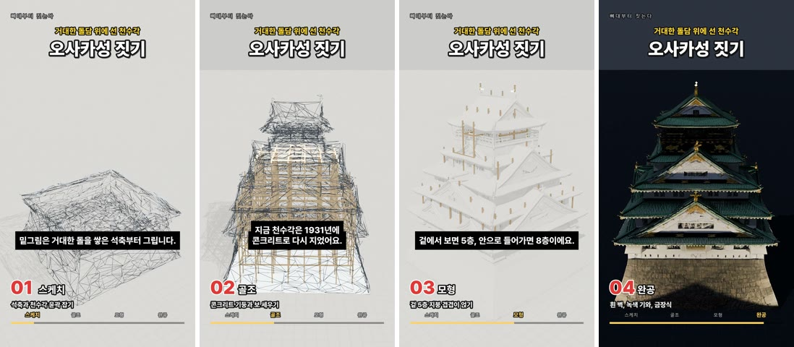
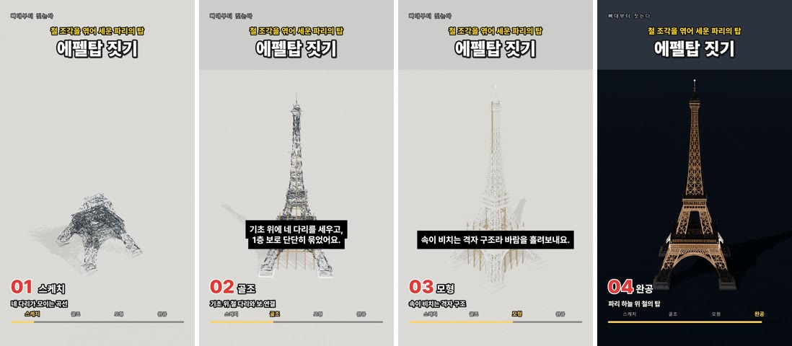

# 뼈대부터 짓는다 · skeleton-to-shorts

**주제 한 줄 → 30초 세로 쇼츠.** "에펠탑", "오사카성", "헤드셋"처럼 주제만 넣으면 대상이 **스케치 → 뼈대 → 모형 → 완공**으로 지어지는 9:16 영상이 자동으로 나옵니다.




샘플 영상: [samples/osaka.mp4](samples/osaka.mp4) · [samples/eiffel.mp4](samples/eiffel.mp4) (용량을 줄인 540×960 미리보기, 원본은 1080×1920)

---

> ## ⚠️ 필수 준비물 — 이것 없으면 동작하지 않습니다
>
> | # | 필요한 것 | 무엇에 쓰나 | 준비 방법 |
> |---|---|---|---|
> | 1 | **Claude Opus 5.5 API 키 (본인 발급)** | 제목·단계 자막·내레이션·이미지 프롬프트 기획 | [console.anthropic.com](https://console.anthropic.com) → API Keys에서 **직접 발급** → `.env`의 `ANTHROPIC_API_KEY` |
> | 2 | **Higgsfield 계정 + 크레딧 + Higgsfield MCP 인증** | 완성 이미지·3D 모델·음성·배경음악 생성 | [higgsfield.ai](https://higgsfield.ai) 가입 → `npm install -g @higgsfield/cli` → `higgsfield auth login` |
> | 3 | **Blender 5.2 이상** | 3D 모델을 건설 애니메이션으로 렌더 | [blender.org](https://www.blender.org/download/) 설치 (경로는 자동 탐색, 안 되면 `.env`의 `BLENDER_PATH`) |
> | 4 | ffmpeg · Python 3.10+ · Node.js | 합성·서버·Higgsfield CLI | `ffmpeg`가 PATH에 있어야 함 · `pip install -r requirements.txt` |
> | 5 | (권장) NVIDIA GPU, VRAM 6GB 이상 | 1080p 렌더 약 15분 | 없으면 720p 미리보기 품질로 |
>
> 🔐 **API 키는 저장소에 없습니다.** 각자 발급해서 로컬 `.env`에만 넣으세요. `.env`는 `.gitignore`에 들어 있어 커밋되지 않습니다.
>
> 💳 **비용은 본인 계정에서 나갑니다.** 한 편당 Higgsfield 약 **35.53 크레딧** + Claude API 약 **$0.04**(Anthropic 별도 청구).

---

## 가장 빠른 설치 — Claude Code(Opus 5.5)에게 맡기기

이 저장소는 **Claude Opus 5.5가 클론만 하면 스스로 설치·점검할 수 있게** 만들었습니다. Claude Code에서 모델을 Opus 5.5로 두고:

```
이 저장소를 클론하고 HANDOFF.md를 읽은 뒤 설치해줘. API 키는 내가 .env에 직접 넣을게.
```

에이전트가 읽는 전체 명세는 **[HANDOFF.md](HANDOFF.md)** 에 있습니다.

## 직접 설치

```bash
git clone https://github.com/AiCrafter-pro/skeleton-to-shorts.git
cd skeleton-to-shorts
pip install -r requirements.txt
cp .env.example .env          # Windows: copy .env.example .env
#   → .env 를 열어 ANTHROPIC_API_KEY 에 본인 키 입력
npm install -g @higgsfield/cli
higgsfield auth login          # 브라우저에서 Higgsfield 로그인
python check_setup.py          # 필수 준비물 점검 (키 값은 출력하지 않음)
```

실행: Windows `run.cmd` 더블클릭 · macOS/Linux `./run.sh` → 브라우저에서 **http://127.0.0.1:8932**

## 어떻게 만들어지나

| 단계 | 담당 | 파일 |
|---|---|---|
| 1 기획 — 제목, 4단계 자막, 내레이션 6줄, 이미지·음악 프롬프트 | **Claude Opus 5.5** (구조화 출력) | `app/planner.py` |
| 2 완성 이미지 1장 | Higgsfield MCP · GPT Image 2.5 (2.75) | `app/pipeline.py` |
| 3 텍스처 3D 모델 | Higgsfield MCP · image_to_3d (30) | 〃 |
| 4 내레이션 · 배경음악 | Higgsfield MCP · TTS (0.9) · Sonilo Music (1.88) | 〃 (3과 동시) |
| 5 건설 애니메이션 900프레임 | **Blender** (내 PC GPU) | `app/blender_build.py` |
| 6 자막·단계 표시·음악 합성 | ffmpeg | `app/compose.py` |

한 편에 약 20분(렌더 약 15분, RTX 2060 SUPER 기준). 결과는 `jobs/<작업ID>/final.mp4`.

- **유료 단계는 결과 파일이 있으면 건너뜁니다.** 실패해도 자동으로 다시 결제하지 않고, UI에서 "이어서 진행"을 눌러야 다시 시도합니다.
- Blender는 분리된 설정 폴더(`.blender_isolated/`)로 실행돼 평소 쓰는 Blender 설정·애드온을 건드리지 않습니다.
- 선택 기능 「Blender 창에서 재생」: 열린 Blender에 Higgsfield Blender 애드온이 켜져 있으면 렌더 없이 바로 건설 과정을 볼 수 있습니다.

## 문서
- [HANDOFF.md](HANDOFF.md) — 설치·설정·API 명세·문제 해결 (에이전트용)
- [docs/ARCHITECTURE.md](docs/ARCHITECTURE.md) — 구조, Blender 연출, 알려진 함정

## 주의
- 생성물 사용 조건은 Higgsfield·각 모델의 약관을 따르세요. 기획 단계에서 실존 브랜드·로고는 쓰지 않도록 지시돼 있습니다.
- 샘플 영상은 이 도구로 만든 결과물입니다.

## 라이선스
코드: [MIT](LICENSE) · 폰트: Pretendard ([SIL OFL 1.1](app/fonts/OFL-Pretendard.txt))

## 만든 곳 · 문의
**AiCrafter** — Claude Opus 5.5 × Higgsfield MCP 영상에서 소개한 도구입니다.

- 📺 유튜브 채널 **AI크래프터**: https://www.youtube.com/@Aicrafter-pro
- 💬 궁금한 점은 **AI크래프터 오픈톡방**으로: https://open.kakao.com/o/pWyXqthi
